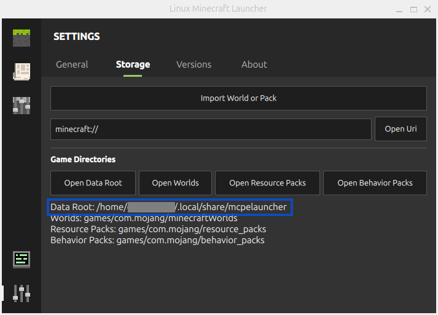

# Frequently Asked Questions

## Do I need to own Minecraft: Pocket Edition to play?

Yes. To download and update a compatible versions of the Game, the
Google Play account you sign in with needs to own the game on the Play
Store. Then you are able to download and play some previous versions of
the game as well, althought not offically supported by Google Play.

### The launcher **cannot** download the game from:

- The Amazon App store, althought may or may not work on arm devices.
  You have to extract the apk from an amazon device.

### The launcher **cannot** download and **cannot** launch the game from:

This would require a completly different Launcher, if that would even
possible

- The Apple iOS App store
- The Microsoft Store, previously by redeeming a gift code for
  Minecraft: Windows 10 Edition

## Does it work on Windows 7 / 8?

No, due to the amount of work required to get this running on Windows.
Play the Windows 10 Edition instead if you can. Note that you can not
play Minecraft in the current version of [Windows Subsystem for Linux
(WSL)](https://en.wikipedia.org/wiki/Windows_Subsystem_for_Linux), as
the mouse input is broken due to an
[issue](https://github.com/microsoft/wslg/issues/240) with its graphic
stack.

## How does it work?

The project runs the native libraries from the Android version directly
on your computer. This is accomplished by fixing the incompatibilities
between the libc used on Android and the one used on desktop Linux or OS
X (Android - Bionic; Linux - glibc). This is a simple compatibility
layer which doesn't impact performance in any significant way; it's
similar to Wine, but much more lightweight and simple. Aditionally, all
Android-specific code has been rewritten to run on Linux (AppPlatform,
Store, Xbox Live, etc.).

## Where are my worlds?

Linux: `~/.local/share/mcpelauncher/games/com.mojang/minecraftWorlds`

Linux (Flatpak):
`~/.var/app/io.mrarm.mcpelauncher/data/mcpelauncher/games/com.mojang/minecraftWorlds`

Mac OS X:
`~/Library/Application Support/mcpelauncher/games/com.mojang/minecraftWorlds`

Each world has its own directory. If you have multiple worlds, you can
identify them by their name in `levelname.txt` found in each world.

The `mcpelauncher-server` creates and expects its world files in
`world`.

## Can I use resource packs?

Yes, put them in
`~/.local/share/mcpelauncher/games/com.mojang/resource_packs`.

(For Flatpak)
`~/.var/app/io.mrarm.mcpelauncher/data/mcpelauncher/games/com.mojang/resource_packs`

For Mac OS X, put them in
`~/Library/Application Support/mcpelauncher/games/com.mojang/resource_packs`.

Shaders are also resource packs. (Shaders must be GLSL based and must be
compatible with your graphics drivers)

**Note:** You will probably need to extract `.zip` and `.mcpack` files
into their own subdirectory for them to work properly.

## Can I reenable the native fmod mode?

Yes for Minecraft 1.21.2x and below by extracting the lib/native folder of https://github.com/minecraft-linux/mcpelauncher-linux-bin/tree/1e84fde7d5fb90b913c84b9945700ef6af69df12 or https://github.com/minecraft-linux/mcpelauncher-mac-bin/tree/5189766d94de83a9fa6ea4f8477b1a5faca05bdb directly under [`Data Root`](#where-is-the-data-root-folder)`/lib/native`

## Where is the Data Root folder?

An incomplete list of known values, if your launcher profile has no  custom path.

Package Type|Path
---|---
linux|`~/.local/share/mcpelauncher`
linux (flatpak)|`~/.var/app/io.mrarm.mcpelauncher`
macOS|`~/Library/Application Support/mcpelauncher`
